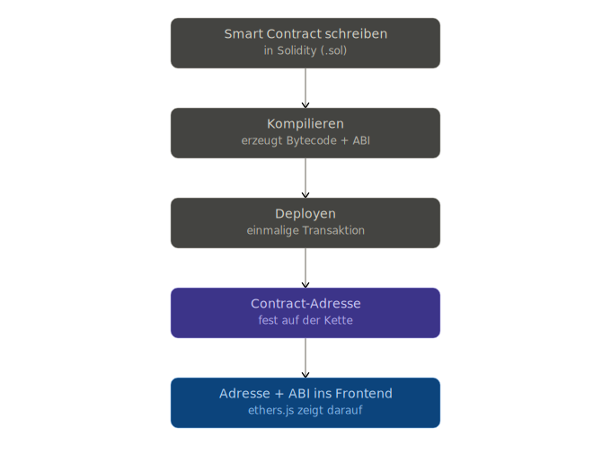
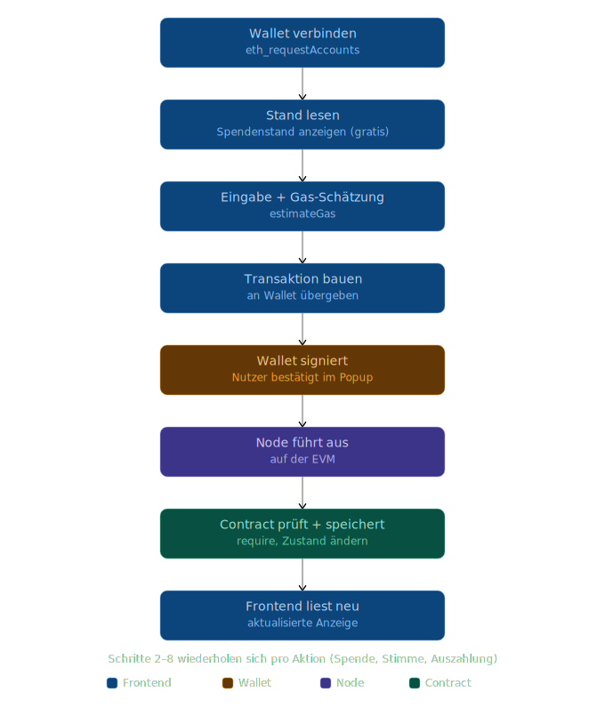

# blockchain-donation

Spenden-dApp als **npm-Workspaces-Monorepo**: Smart Contracts (Hardhat 3 +
ethers v6) in [`packages/contracts`](packages/contracts), Vue-3-Frontend in
[`packages/frontend`](packages/frontend). Die Contracts erzeugen beim Kompilieren
ABIs und typsichere TypeScript-Bindings, die automatisch ins Frontend gespiegelt
werden — so „zeigt" das Frontend per ethers.js auf den deployten Contract.

> **Hinweis zum Stand:** Der aktuelle Contract `Counter` ist der Platzhalter aus
> dem Hardhat-3-Sample. Die eigentliche Spenden-Logik (Spende / Stimme /
> Auszahlung, siehe Diagramme unten) wird hier noch eingesetzt. Die gesamte
> Architektur und das Tooling stehen aber bereits.

---

## Architektur

### Monorepo-Aufbau

```
blockchain-donation/
├─ .nvmrc / .node-version          # Node-Version-Pin (22 LTS)
├─ package.json                    # Root: Workspaces + Orchestrierungs-Scripts
├─ docs/                           # Architektur-Diagramme (SVG)
└─ packages/
   ├─ contracts/                   # Hardhat 3 · Solidity · ethers v6 · TypeChain
   │  ├─ contracts/                #   *.sol  (Counter = Platzhalter, + *.t.sol)
   │  ├─ test/                     #   TS-Integrationstests (mocha + ethers)
   │  ├─ ignition/modules/         #   Ignition-Deploy-Module
   │  ├─ scripts/                  #   copy-artifacts.js, send-op-tx.ts
   │  ├─ hardhat.config.ts         #   Netzwerke, solidity-Profile, typechain
   │  ├─ types/ethers-contracts/   #   generierte TypeChain-Typen   (gitignored)
   │  └─ artifacts/                #   Bytecode + ABI               (gitignored)
   └─ frontend/                    # Vue 3 · Vite · ethers v6
      └─ src/
         ├─ contracts/             #   generiert via copy-artifacts (gitignored)
         │  ├─ abi/*.json          #     reine ABIs
         │  └─ typechain/          #     typsichere Contract-Factories
         ├─ components/ views/ stores/ router/
         └─ main.ts
```

### Tech-Stack

| Bereich | Tools |
| --- | --- |
| Contracts | Hardhat **3.8**, Solidity **0.8.28**, ethers **v6**, TypeChain, Hardhat **Ignition**, Mocha + chai |
| Frontend | Vue **3.5**, Vite **8**, TypeScript, Pinia, Vue Router, ethers **v6**, Vitest |
| Monorepo | npm Workspaces, Node **22 LTS** |

### Wie Contracts und Frontend zusammenspielen

Zwei Abläufe (Diagramme in [`docs/`](docs/)):

**1. Einmalig — schreiben, kompilieren, deployen**

<p align="center">
  
</p>

Jeder Schritt konkret im Projekt:

| Schritt im Diagramm | Im Repo |
| --- | --- |
| Smart Contract schreiben (`.sol`) | [`packages/contracts/contracts/`](packages/contracts/contracts) |
| Kompilieren → Bytecode + ABI | `npm run compile` → `artifacts/` + `types/` |
| Deployen (einmalige Transaktion) | `npm run deploy:local` / `deploy:sepolia` (Hardhat Ignition) |
| Contract-Adresse (fest auf der Kette) | Ausgabe von Ignition → ins Frontend als `VITE_CONTRACT_ADDRESS` |
| Adresse + ABI ins Frontend | `postcompile` spiegelt ABI/Typen nach `frontend/src/contracts/` |

**2. Laufzeit — pro Spende** (Schritte 2–8 wiederholen sich pro Aktion: Spende, Stimme, Auszahlung)

<p align="center">
  
</p>

Die Farben markieren die beteiligte Schicht — **Frontend**, **Wallet**, **Node**,
**Contract** — und so sieht das mit ethers v6 aus:

| Schritt im Diagramm | Schicht | ethers v6 |
| --- | --- | --- |
| Wallet verbinden | Frontend → Wallet | `new BrowserProvider(window.ethereum)`, `await provider.getSigner()` |
| Stand lesen (gratis) | Frontend → Node | `await contract.<view>()` — read-only, keine Gas-Kosten |
| Eingabe + Gas-Schätzung | Frontend | `await contract.<fn>.estimateGas(...)` |
| Transaktion bauen + übergeben | Frontend → Wallet | `await contract.<fn>(...)` |
| Wallet signiert | Wallet | Nutzer bestätigt im MetaMask-Popup |
| Node führt aus (EVM) | Node | Transaktion wird ausgeführt/gemined |
| Contract prüft + speichert | Contract | `require`, Zustandsänderung, `emit` Event |
| Frontend liest neu | Frontend | `await tx.wait()`, dann erneut lesen |

**Die ABI-/Typen-Brücke (automatisch beim `compile`):**

```
hardhat compile
  ├─ erzeugt  artifacts/…/<Name>.json        (ABI + Bytecode)
  ├─ erzeugt  types/ethers-contracts/…        (TypeChain, target ethers-v6)
  └─ postcompile: scripts/copy-artifacts.js
        ├─ ABIs            → packages/frontend/src/contracts/abi/<Name>.json
        └─ TypeChain-Typen → packages/frontend/src/contracts/typechain/
           (ohne hardhat.d.ts; mit // @ts-nocheck, damit vue-tsc nicht bricht)
```

`packages/frontend/src/contracts/` ist **generiert und gitignored** — es entsteht
neu bei jedem `compile`. Deshalb kompilieren die Root-Scripts `dev`/`build` immer
zuerst die Contracts. Secrets stehen **nicht** in `.env`, sondern im
verschlüsselten Hardhat-Keystore (siehe [Deployment](#deployment)).

---

## Voraussetzungen

- **Node.js 22 LTS** (≥ 22.13.0). Hardhat 3 verlangt diese Version; auf Node 24/25
  scheitert der Solidity-Test-Reporter (siehe [Troubleshooting](#troubleshooting)).
- Das Repo pinnt die Version in `.nvmrc` / `.node-version`. Mit nvm/fnm/Volta:

  ```sh
  nvm use        # oder: fnm use   → liest .nvmrc / .node-version
  ```

  Ohne Versionsmanager einfach Node 22 LTS verwenden. Die `engines`-Felder sind
  ein Hinweis (npm **warnt**, blockiert die Installation aber nicht).

---

## Erste Schritte

```sh
git clone https://github.com/FarbKlexx/blockchain-donation.git && cd blockchain-donation
nvm use                 # Node 22 aktivieren
npm install             # installiert alle Workspaces auf einmal
npm run compile         # Contracts kompilieren + ABIs/Typen ins Frontend spiegeln
npm run dev             # Frontend starten (kompiliert vorher die Contracts)
```

> `npm install` einmal im Root genügt — npm Workspaces installiert beide Pakete
> gemeinsam und teilt Dependencies über das Root-`node_modules`.

---

## Entwickeln: Contracts (`packages/contracts`)

Typischer Loop: Contract in `contracts/*.sol` ändern → Test in `test/*.ts` (oder
Solidity-Test `*.t.sol`) anpassen → `compile` → `test`.

```sh
npm run compile -w contracts        # kompiliert + erzeugt Typen + kopiert ins Frontend
npm run test -w contracts           # alle Tests
# alternativ direkt im Paket:
cd packages/contracts
npx hardhat test mocha              # nur die TS/mocha-Tests
npx hardhat test solidity           # nur die Solidity-Tests (*.t.sol)
```

| Script (`-w contracts`) | Befehl | Zweck |
| --- | --- | --- |
| `compile` | `hardhat compile` | Kompiliert, erzeugt TypeChain-Typen, triggert `postcompile` |
| `test` | `hardhat test` | Solidity- **und** mocha-Tests |
| `node` | `hardhat node` | Persistente lokale Chain (HTTP-JSON-RPC auf `127.0.0.1:8545`) |
| `deploy:local` | `hardhat ignition deploy …/Counter.ts --network localhost` | Deployt gegen die laufende lokale Node |
| `deploy:sepolia` | `hardhat ignition deploy …/Counter.ts --network sepolia` | Deployt nach Sepolia |
| `postcompile` | `node scripts/copy-artifacts.js` | Läuft automatisch nach `compile`: spiegelt ABIs/Typen ins Frontend |

**Wissenswert**
- **Typsicherheit:** Die Toolbox generiert TypeChain-Bindings (`Counter`,
  `Counter__factory`) nach `types/ethers-contracts/`. In Tests sind die
  ethers-Helfer automatisch typisiert: `await ethers.deployContract("Counter")`
  liefert ein getyptes `Counter`. Beispiel siehe [test/Counter.ts](packages/contracts/test/Counter.ts).
- **Neuen Contract hinzufügen:** `.sol` unter `contracts/` anlegen, ein
  Ignition-Modul unter `ignition/modules/` (mit `m.contract("…")`) schreiben und
  in `deploy:local`/`deploy:sepolia` (in [package.json](packages/contracts/package.json))
  auf das neue Modul zeigen.
- **Profile:** `compile`/`test` nutzen das `default`-Solidity-Profil, ein Ignition-
  Deployment standardmäßig das optimierte `production`-Profil (siehe
  [hardhat.config.ts](packages/contracts/hardhat.config.ts)).

---

## Entwickeln: Frontend (`packages/frontend`)

```sh
npm run dev -w frontend       # Vite-Dev-Server (Hot Reload)
npm run build -w frontend     # Type-Check + Production-Build
```

> Damit die generierten Contract-Typen existieren, vorher mindestens einmal
> `npm run compile` ausführen. Die Root-Scripts `npm run dev` / `npm run build`
> erledigen das automatisch.

| Script (`-w frontend`) | Befehl | Zweck |
| --- | --- | --- |
| `dev` | `vite` | Dev-Server mit Hot-Module-Reload |
| `build` | type-check **+** `build-only` | Produktions-Build (parallel) |
| `build-only` | `vite build` | Nur bauen, ohne Type-Check |
| `preview` | `vite preview` | Production-Build lokal ansehen |
| `type-check` | `vue-tsc --build` | TypeScript-/Vue-Typprüfung |
| `test:unit` | `vitest` | Unit-Tests (Vitest) |
| `lint` | `oxlint` + `eslint` (`--fix`) | Linten & autofixen |
| `format` | `prettier --write src/` | Formatieren |

**Contract im Frontend ansprechen (ethers v6)**
Die generierten Typen/ABIs liegen unter `src/contracts/`. Die Contract-Adresse
kommt nach dem Deploy aus `VITE_CONTRACT_ADDRESS` (siehe
[`.env.example`](packages/frontend/.env.example)). Skizze:

```ts
import { BrowserProvider } from 'ethers'
import { Counter__factory } from '@/contracts/typechain'

const provider = new BrowserProvider(window.ethereum) // EIP-1193 (MetaMask)
const signer   = await provider.getSigner()           // v6: async!
const contract = Counter__factory.connect(
  import.meta.env.VITE_CONTRACT_ADDRESS,
  signer,
)

const value = await contract.x()        // Reads: einfach awaiten (Rückgabe = BigInt)
const tx    = await contract.inc()      // Writes: Transaktion …
await tx.wait()                         // … und auf Bestätigung warten
```

> ethers **v6**-Besonderheiten: `BrowserProvider` (nicht `Web3Provider`),
> `getSigner()` ist **async**, Zahlen sind **BigInt** (nicht `BigNumber`),
> `parseEther`/`formatEther` sind Top-Level-Importe, Adresse via
> `await contract.getAddress()`.

---

## Deployment

**Lokal** (zwei Terminals):

```sh
npm run node            # Terminal 1: lokale Chain starten
npm run deploy:local    # Terminal 2: Ignition-Modul dagegen deployen
```

**Sepolia** — Secrets liegen im verschlüsselten Keystore (Hardhat 3 hat **keinen**
`.env`-Loader; `configVariable` liest aus Keystore bzw. Env-Variablen):

```sh
cd packages/contracts
npx hardhat keystore set SEPOLIA_RPC_URL
npx hardhat keystore set SEPOLIA_PRIVATE_KEY
npm run deploy:sepolia -w contracts
```

In CI wird der Keystore umgangen → dort die Werte als **Umgebungsvariablen**
setzen. Referenz: [`packages/contracts/.env.example`](packages/contracts/.env.example).
Ignition merkt sich den Deployment-Status (idempotent) und gibt die deployte
Adresse aus — diese ins Frontend-`.env` als `VITE_CONTRACT_ADDRESS` eintragen.

---

## Script-Referenz (Root)

Im Repo-Root ausführbar; delegieren an die passenden Workspaces:

| Script | Zweck |
| --- | --- |
| `npm run compile` | Contracts kompilieren (Typen + ABIs ins Frontend) |
| `npm run test:contracts` | Hardhat-Tests |
| `npm run node` | Lokale Hardhat-Node starten |
| `npm run deploy:local` | Ignition-Deployment gegen die lokale Node |
| `npm run deploy:sepolia` | Ignition-Deployment nach Sepolia |
| `npm run dev` | Contracts kompilieren **+** Frontend-Dev-Server |
| `npm run build` | Contracts kompilieren **+** Frontend-Production-Build |

Einzelne Workspace-Scripts gezielt: `npm run <script> -w contracts` bzw.
`-w frontend` (oder `cd packages/<paket> && npm run <script>`).

---

## Troubleshooting

- **`npm run test:contracts` crasht mit `ERR_INVALID_ARG_VALUE … 'grey'`**
  Du bist auf Node 24/25. Hardhat 3.8.0's Solidity-Test-Reporter nutzt eine
  Farbe (`grey`), die neuere Node-Versionen nicht mehr akzeptieren. → **Node 22
  LTS verwenden** (`nvm use`). Übergangsweise laufen die TS-Tests via
  `npx hardhat test mocha`.
- **`Cannot find module '@/contracts/typechain'`**
  Die generierten Typen fehlen → einmal `npm run compile` ausführen (sie sind
  gitignored und entstehen erst beim Kompilieren).
- **`npm warn EBADENGINE … required: { node: '^22.13.0' }`**
  Nur ein Hinweis, dass du nicht auf Node 22 bist. Die Installation läuft
  trotzdem durch.
